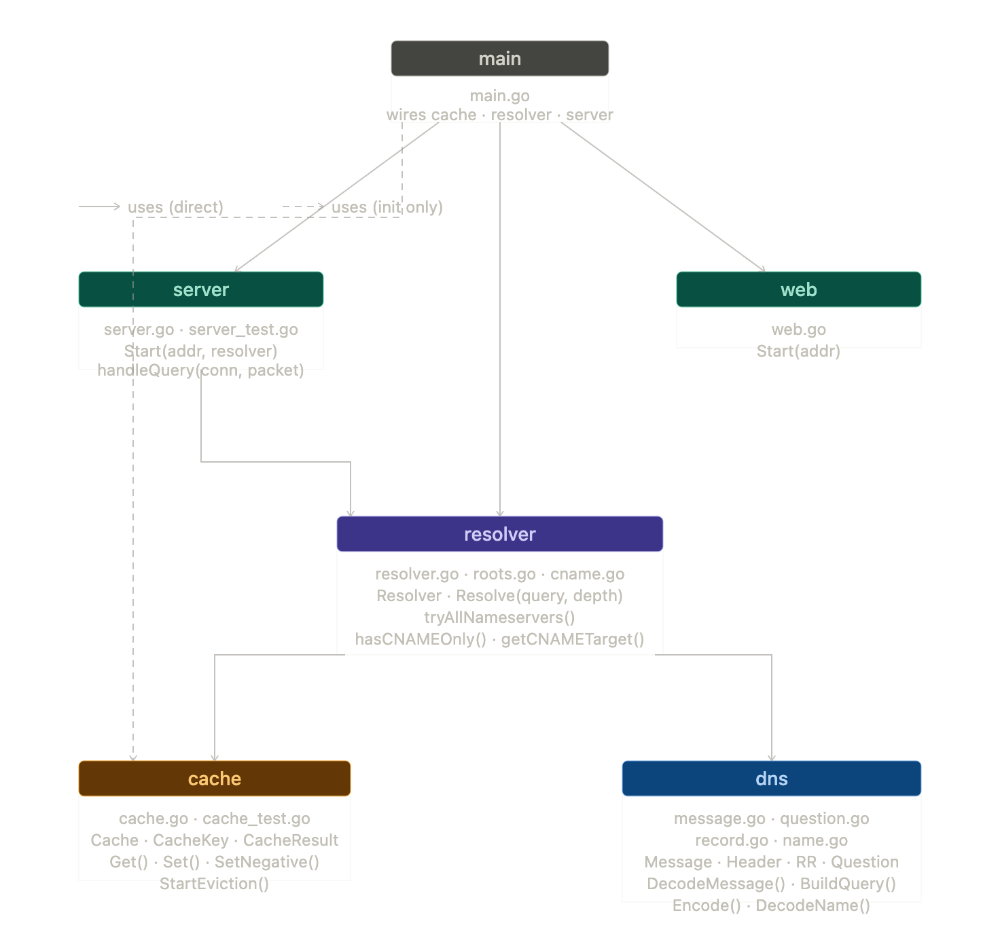

# hulundb-kajus-dns

A recursive DNS resolver built from scratch in Go, developed as a course project for DD1349. Rather than forwarding queries to an upstream resolver, it walks the DNS hierarchy itself — starting from the root nameservers and following referrals down to an authoritative answer. It includes a TTL-aware cache, CNAME chain resolution, and a web interface.

---

## What it does

When a client sends a DNS query to this resolver, it:

1. Checks the cache for an existing answer
2. If not cached, contacts a root nameserver
3. Follows NS referrals down through TLD and authoritative nameservers
4. Handles CNAME chains by recursively resolving the alias target
5. Caches the result and returns the answer to the client

It also handles edge cases: NXDOMAIN responses are negatively cached, SERVFAIL is returned when all nameservers are exhausted, and panics in query handlers are recovered so the server keeps running.

---

## Requirements 

- **Go 1.21 or later**
- **Root / administrator privileges** — the DNS server binds to port 53, which requires elevated permissions on most systems
- No external Go dependencies — built entirely on the standard library

---

## Getting started

Clone and build:

```bash
git clone https://github.com/hulundb/hulundb-kajus-dns.git
cd hulundb-kajus-dns
go build ./...
```

Run (requires root or `sudo` for port 53):

```bash
sudo go run main.go
```

This starts two services:
- **DNS server** on `0.0.0.0:53` (UDP)
- **Web interface** on `0.0.0.0:8080`

Test with `dig`:

```bash
dig @127.0.0.1 example.com A
dig @127.0.0.1 example.com MX
```

Shut down cleanly with `Ctrl+C` — the server handles `SIGINT` and `SIGTERM`.

---

## Testing with a browser

You can route your entire OS through the resolver by pointing your system DNS to `127.0.0.1`. Any domain you visit in the browser will then be resolved by this server. Remember to revert the setting when you're done.

**macOS**

1. Open **System Settings → Wi-Fi** (or **Network** for wired)
2. Click **Details** next to your active connection
3. Go to the **DNS** tab
4. Remove existing entries and add `127.0.0.1`
5. Click **OK** and then **Apply**

**Windows**

1. Open **Settings → Network & Internet → Wi-Fi** (or **Ethernet**)
2. Click on your active connection → **Edit** under DNS server assignment
3. Switch to **Manual**, enable **IPv4**
4. Set **Preferred DNS** to `127.0.0.1`
5. Click **Save**

**Linux (NetworkManager)**

1. Open **Settings → Network** or **Wi-Fi**
2. Click the gear icon next to your active connection
3. Go to the **IPv4** tab
4. Set **DNS** to `127.0.0.1` and turn off **Automatic DNS**
5. Apply and reconnect

> **Note:** Some browsers (Chrome, Firefox) use their own DNS-over-HTTPS by default, which bypasses system DNS. Disable it if your queries aren't hitting the resolver:
> - **Chrome:** Settings → Privacy and security → Security → turn off *Use secure DNS*
> - **Firefox:** Settings → Privacy & Security → scroll to DNS over HTTPS → set to *Off*

---

## Project structure

```
hulundb-kajus-dns/
├── go.mod
├── go.sum
├── main.go                    # Entry point. Wires everything together and starts the server.
│
├── dns/                       # Core DNS protocol — wire format only, no IO.
│   ├── message.go             # Message struct, header parsing/encoding.
│   ├── question.go            # Question section parsing/encoding.
│   ├── record.go              # Resource record types (A, AAAA, NS, CNAME, MX, SOA).
│   ├── name.go                # Name parsing, encoding, and compression/decompression.
│   └── message_test.go        # Table-driven tests for round-trip parsing.
│
├── server/                    # UDP listener. Accepts queries, hands off to resolver.
│   ├── server.go              # ListenAndServe, goroutine-per-query dispatch.
│   └── server_test.go
│
├── web/                    
│   └──  web.go              
│
├── resolver/                  # The recursive walk logic. No parsing, no caching here.
│   ├── resolver.go            # Resolve() — the main recursive loop.
│   ├── roots.go               # Hardcoded root nameserver addresses.
│   └── cname.go
│   └── resolver_test.go
│
├── cache/                     # TTL-aware in-memory cache. No DNS logic here.
│   ├── cache.go               # Get/Set/evict, TTL decrement, NXDOMAIN entries.
│   └── cache_test.go
│
     (NOT IMPLEMENTED)
└── metrics/                   # Counters and timers. Thin wrapper, no dependencies.
    └── metrics.go             # CacheHits, Latency, UpstreamQueries.
```



Dependency flow: `main → server → resolver → dns / cache`

---

## How the cache works

The cache stores DNS records keyed by `(name, type)`. TTLs are respected — on read, the remaining TTL is recalculated and written into the returned records. A background goroutine evicts expired entries every 60 seconds.

Negative caching is also supported: NXDOMAIN responses are stored with a 300-second TTL so repeated queries for non-existent names don't trigger full resolution walks.

---

## How resolution works

Each call to `Resolve()` takes a raw DNS query and a `depth` counter. The depth counter bounds CNAME chain length at 10 to prevent infinite loops.

**Normal resolution:**
1. Decode the query and check the cache
2. Contact a root nameserver
3. Loop: send the query to the current target, decode the response
4. If the response has NS referrals, extract the next nameserver IP — first from glue records in the additional section, then by recursively resolving the NS hostname
5. Repeat until an authoritative answer is received

**CNAME handling:**
When the answer section contains only a CNAME for the queried name (and no records of the requested type), the resolver:
- Extracts the CNAME target
- Checks if the server already included records for the target in the same response
- If yes, assembles and returns the combined answer
- If no, recursively resolves the target and prepends the CNAME record(s)

---

## Project scope and milestones

**M1 — Wire format and UDP server**
- DNS message parsing and serialisation (RFC 1035)
- Label encoding, compression pointer handling
- UDP server with per-query goroutines

**M2 — Recursive resolution**
- Full recursive resolution: root → TLD → authoritative
- Typed record extraction (A, NS, CNAME, MX, etc.)
- CNAME chain following with depth limiting
- NS hostname resolution via glue records with recursive fallback
- SERVFAIL construction when all nameservers fail
**M3 — Caching and robustness**
- TTL-aware positive and negative caching
- Background cache eviction
- Panic recovery in query handlers
- Graceful shutdown on `SIGINT` / `SIGTERM`

---

## Authors

- Hugo ([hulundb@kth.se](https://github.com/hulu05)) — wire format (`dns/`), CNAME resolution, record type handling, cache
- Kajus ([kajus@kth.se](https://github.com/kajus-sir)) — UDP server, recursive resolution loop, NS referral detection, glue record handling

Course: DD1349
